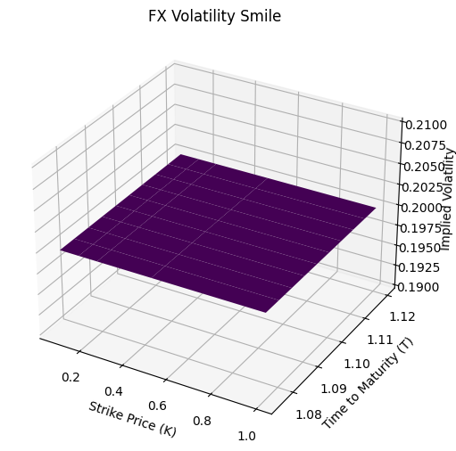

# Calculating Option Price using Garman–Kohlhagen for Foreign Exchange Options

Garman–Kohlhagen is a options pricing model specifically made for FX. Utilzing a similar composition to Black Scholes, we calculate the price of an option through the underlying's spot price, risk free rate (both domestically and foreign), time to maturity, and volatility. I have taken the equations that Garman Kohlhagen has done, and put them into Python.

## Imports


```python
# Importing Packages
import math
import json
import numpy as np
from scipy.stats import norm
import matplotlib.pyplot as plt
import pandas_datareader as reader
from scipy.optimize import minimize
from datetime import datetime, date
```

### Garman–Kohlhagen Equations


### Garman–Kohlhagen Helper Functions


```python
# Calcuating d1 of Black Scholes Equation
def d1(S, K, rd, rf, T, sigma):
    return ((np.log(S/K) + (rd - rf + (sigma ** 2)/2) * T)) / (sigma * np.sqrt(T))

# Calcuating d2 of Black Scholes Equation
def d2(S, K, rd, rf, T, sigma):
    return d1(S, K, rd, rf, T, sigma) - sigma * np.sqrt(T)
       
# Call Option Black Scholes Equation
def gkc(S, K, rd, rf, T, sigma):
    return S * norm.cdf(d1(S, K, rd, rf, T, sigma)) - K * math.exp(-rd * T) * norm.cdf(d2(S, K, rd, rf, T, sigma))

# Put Option Black Scholes Equation
def gkp(S, K, rd, rf, T, sigma):
    return K * math.exp(-rd * T) * norm.cdf(-1 * d2(S, K, rd, rf, T, sigma)) - S * math.exp(-rf * T) * norm.cdf(-1 * d1(S, K, rd, rf, T, sigma))
```

### Garman–Kohlhagen Function


```python
# S is the current spot rate
# K is the strike price
# rd is domestic risk free simple interest rate
# rf is foreign risk free simple interest rate
# T is the time to maturity (calculated according to the appropriate day count convention) 
# sigma is the volatility of the FX rate
# flag 'c' or 'p' for call or put

# GK FX Exchange Option's Pricing Model
def garman_kohlhagen(S, K, rd, rf, T, sigma, flag = "c"):
    if flag == "c":
        price = gkc(S, K, rd, rf, T, sigma)
        
    elif flag == "p":
        price = gkp(S, K, rd, rf, T, sigma)
        
    else:
        raise ValueError("Invalid option type. Either 'c' or 'p' for call or put.")

    return price
```

### Gathering Historical Data on Underlying Currency


```python
# DEXUSEU is U.S. Dollars to Euro Spot Exchange Rate
pair = 'DEXUSEU'
expiry = '12-21-2024'
strike = 1.1250

# Pulling FX Exchange data from Federal Reserve Bank of St. Louis
df = reader.DataReader(pair, 'fred')
df = df.sort_values(by='DATE')
df = df.dropna()

# Calculating Volatility from historical data
df = df.assign(Previous = df.DEXUSEU.shift(1))
df['Returns'] = ((df.DEXUSEU - df.Previous) / df.Previous)
sigma = np.sqrt(252) * df['Returns'].std() 

# Pulling One Yr. Yield data from Federal Reserve Bank of St. Louis
oneyrUSD = reader.DataReader('DGS1', 'fred').iloc[-1] / 100
oneyrEUR = reader.DataReader('ECBESTRVOLWGTTRMDMNRT', 'fred').iloc[-1] / 100
spot = df['DEXUSEU'].iloc[-1]

# Calculating Time to Maturity
today = datetime.now()
one_year_ago = today.replace(year=today.year - 1)
T = (datetime.strptime(expiry, "%m-%d-%Y") - datetime.utcnow()).days / 365
```

### Calculating Option Price


```python
# Variables for Pricing
print("Spot Price:      ", round(spot, 3))
print("Strike Price:    ", round(strike, 3))
print("1 Yr US Yield %: ", round(oneyrUSD[0] * 100, 3))
print("1 Yr EU Yield %: ", round(oneyrEUR[0] * 100, 3))
print("DTE:             ", round(T, 3))
print("Sigma:           ", round(sigma, 3))

# Storing Option Price for use in calcualting Implied Volatility
option_call_price = garman_kohlhagen(spot, strike, oneyrUSD[0], oneyrEUR, T, sigma, "c")[0]
option_put_price = garman_kohlhagen(spot, strike, oneyrUSD[0], oneyrEUR, T, sigma, "p")[0]

# Print Option Price
print("Call Price:      ",  round(option_call_price, 3))
print("Put Price:       ",  round(option_put_price, 3))
```

    Spot Price:       1.088
    Strike Price:     1.125
    1 Yr US Yield %:  5.25
    1 Yr EU Yield %:  3.903
    DTE:              1.079
    Sigma:            0.073
    Call Price:       0.041
    Put Price:        0.043


### Resources Utilized for GK Equations

GK Equations:
https://en.wikipedia.org/wiki/Foreign_exchange_option

Black Scholes Inspiration:
https://quantpy.com.au/black-scholes-model/calculating-black-scholes-greeks-with-python/

Data Collection Inspiration:
https://www.suhailsaqan.com/blog/black-scholes/

# Calculating Implied Volatility using Garman–Kohlhagen Functions

### Function to find minimum numerical optimized Sigma within GK Model


```python
def implied_volatility(option_price, S, K, rd, rf, T, initial_guess = 0.2, flag = "c"):
    # Calculating Implied Volatility using both the GK model and numerical optimization from the Scipy minimize function
    implied_volatility_function = lambda sigma : np.sum((garman_kohlhagen(S, K, rd, rf, T, sigma, flag) - option_price) ** 2)

    # Numerical Optimization to find the sigma value with the least squared difference to the GK Pricing Model
    optimal_difference = minimize(implied_volatility_function, initial_guess, bounds=[(0,1)])
    
    return optimal_difference.x[0]
```

### Caclulating Implied Volatility using Numerical Optimization Functions


```python
# Implied Volatility of Option
IV = implied_volatility(option_call_price, spot, strike, oneyrUSD, oneyrEUR, T, sigma, "c")

# Printing out Implied Volatility, Sigma, & Difference
print("Implied Volatility:      ", round(IV, 3))
print("Historical Volatility:   ", round(sigma, 3))
```

    Implied Volatility:       0.073
    Historical Volatility:    0.073


# Volatility Smile Construction Functions

### Calculating Volatility Smile


```python
# Constructing the volatility smile from the strikes and maturities lists given
def volatility_smile(option_prices, S, Ks, Ts, rd, rf):
    implied_volatilities = []
    
    # Loop through the maturities
    for T in Ts:
        # Loop through the strike prices
        for K in Ks:
            # Pull the option price by using the maturity and strike price as a key
            option_price = option_prices[(K, T)]

            # Calculate the implied_volatility from the given parameters
            iv = implied_volatility(option_price, S, K, rd, rf, T)
            implied_volatilities.append((K, T, iv))

    return implied_volatilities
```

### Plotting Volatility Smile


```python
def plot_volatility_smile(implied_volatilities):
    fig = plt.figure(figsize=(10, 6))
    ax = fig.add_subplot(111, projection='3d')

    K_values = np.unique([item[0] for item in implied_volatilities])
    T_values = np.unique([item[1] for item in implied_volatilities])

    K, T = np.meshgrid(K_values, T_values)
    IV = np.array([item[2] for item in implied_volatilities]).reshape(K.shape)

    ax.plot_surface(K, T, IV, cmap='viridis')
    ax.set_xlabel('Strike Price (K)')
    ax.set_ylabel('Time to Maturity (T)')
    ax.set_zlabel('Implied Volatility')

    plt.title('FX Volatility Smile')
    plt.show()
```

# Collecting EUR/USD Strikes & Maturities

### Hard coding in the maturities for EUR/USD from CME Group's Option Chain / Investing.com


```python
# Strike Prices for Nov 21st, 2023 from Investing.com on EUR/USD Options
Ks = [29 / 365, 61 / 365, 92 / 365, 182 / 365, 365 / 365]

# Maturities from CME Group EUR/USD Options Chain
Ts = [1.075, 1.08, 1.085, 1.09, 1.095, 1.1, 1.105, 1.11, 1.115, 1.12]
```

### Creating list of all option contract possibilities


```python
option_prices_calls = {}
option_prices_puts = {}

# Populating lists with all possible strike and maturities combo
for K in Ks:
    for T in Ts:
        # Calculating the given modeled option price at the given strike and maturity combo for both calls and puts
        option_prices_calls[(K, T)] = garman_kohlhagen(spot, K, oneyrUSD[0], oneyrEUR[0], T, sigma, "c")
        option_prices_puts[(K, T)] = garman_kohlhagen(spot, K, oneyrUSD[0], oneyrEUR[0], T, sigma, "p")
```

### Resouces Utilized

Strikes for EUR/USD Options Chain: 
https://www.investing.com/currencies/eur-usd-options

Maturities for EUR/USD Options Chain: 
https://www.cmegroup.com/markets/fx/g10/euro-fx.quotes.options.html#venue=globex&expiration=8116-G4

# Volatility Smile Construction


```python
implied_volatilities = volatility_smile(option_prices_calls, spot, Ks, Ts, oneyrUSD, oneyrEUR)
print(implied_volatilities)
plot_volatility_smile(implied_volatilities)
```

    [(0.07945205479452055, 1.075, 0.2), (0.16712328767123288, 1.075, 0.2), (0.25205479452054796, 1.075, 0.2), (0.4986301369863014, 1.075, 0.2), (1.0, 1.075, 0.2), (0.07945205479452055, 1.08, 0.2), (0.16712328767123288, 1.08, 0.2), (0.25205479452054796, 1.08, 0.2), (0.4986301369863014, 1.08, 0.2), (1.0, 1.08, 0.2), (0.07945205479452055, 1.085, 0.2), (0.16712328767123288, 1.085, 0.2), (0.25205479452054796, 1.085, 0.2), (0.4986301369863014, 1.085, 0.2), (1.0, 1.085, 0.2), (0.07945205479452055, 1.09, 0.2), (0.16712328767123288, 1.09, 0.2), (0.25205479452054796, 1.09, 0.2), (0.4986301369863014, 1.09, 0.2), (1.0, 1.09, 0.2), (0.07945205479452055, 1.095, 0.2), (0.16712328767123288, 1.095, 0.2), (0.25205479452054796, 1.095, 0.2), (0.4986301369863014, 1.095, 0.2), (1.0, 1.095, 0.2), (0.07945205479452055, 1.1, 0.2), (0.16712328767123288, 1.1, 0.2), (0.25205479452054796, 1.1, 0.2), (0.4986301369863014, 1.1, 0.2), (1.0, 1.1, 0.2), (0.07945205479452055, 1.105, 0.2), (0.16712328767123288, 1.105, 0.2), (0.25205479452054796, 1.105, 0.2), (0.4986301369863014, 1.105, 0.2), (1.0, 1.105, 0.2), (0.07945205479452055, 1.11, 0.2), (0.16712328767123288, 1.11, 0.2), (0.25205479452054796, 1.11, 0.2), (0.4986301369863014, 1.11, 0.2), (1.0, 1.11, 0.2), (0.07945205479452055, 1.115, 0.2), (0.16712328767123288, 1.115, 0.2), (0.25205479452054796, 1.115, 0.2), (0.4986301369863014, 1.115, 0.2), (1.0, 1.115, 0.2), (0.07945205479452055, 1.12, 0.2), (0.16712328767123288, 1.12, 0.2), (0.25205479452054796, 1.12, 0.2), (0.4986301369863014, 1.12, 0.2), (1.0, 1.12, 0.2)]


    

    


```python

```
