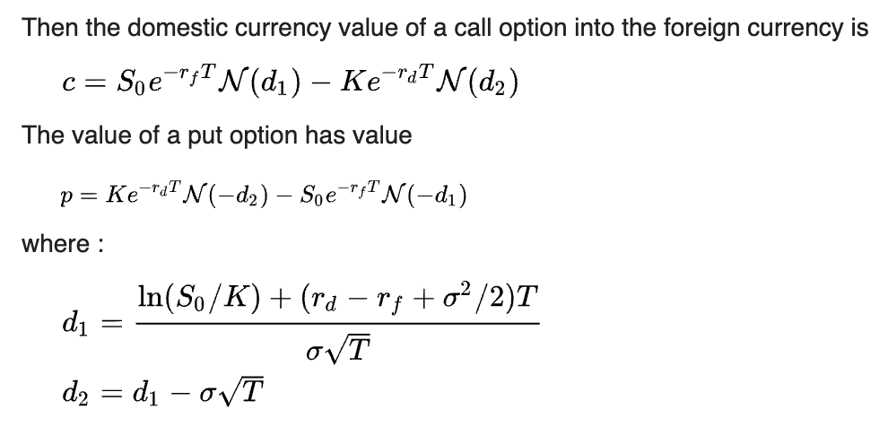

# Calculating Garman–Kohlhagen for FX Options

Garman–Kohlhagen is a options pricing model specifically made for FX. Utilzing a similar composition to Black Scholes, we calculate the price of an option through the underlying's spot price, risk free rate (both domestically and foreign), time to maturity, and volatility. I have taken the equations that Garman Kohlhagen has done, and put them into Python.

## Imports


```python
# Numpy & Scipy
import numpy as np
from scipy.stats import norm
from datetime import datetime, date
import pandas_datareader as reader
import math
```

### Garman–Kohlhagen Equations



### Garman–Kohlhagen Helper Functions


```python
# Calcuating d1 of Black Scholes Equation
def d1(S, K, rd, rf, T, sigma):
    return ((np.log(S/K) + (rd - rf + (sigma ** 2)/2) * T)) / (sigma * np.sqrt(T))

# Calcuating d2 of Black Scholes Equation
def d2(S, K, rd, rf, T, sigma):
    return d1(S, K, rd, rf, T, sigma) - sigma * np.sqrt(T)
       
# Call Option Black Scholes Equation
def gkc(S, K, rd, rf, T, sigma):
    return S * norm.cdf(d1(S, K, rd, rf, T, sigma)) - K * math.exp(-rd * T) * norm.cdf(d2(S, K, rd, rf, T, sigma))

# Put Option Black Scholes Equation
def gkp(S, K, rd, rf, T, sigma):
    return K * math.exp(-rd * T) * norm.cdf(-1 * d2(S, K, rd, rf, T, sigma)) - S * math.exp(-rf * T) * norm.cdf(-1 * d1(S, K, rd, rf, T, sigma))
```

### Garman–Kohlhagen Function


```python
# S is the current spot rate
# K is the strike price
# rd is domestic risk free simple interest rate
# rf is foreign risk free simple interest rate
# T is the time to maturity (calculated according to the appropriate day count convention) 
# sigma is the volatility of the FX rate
# flag 'c' or 'p' for call or put

# GK FX Exchange Option's Pricing Model
def garman_kohlhagen(S, K, rd, rf, T, sigma, flag = "c"):
    if flag == "c":
        price = gkc(S, K, rd, rf, T, sigma)
        
    elif flag == "p":
        price = gkp(S, K, rd, rf, T, sigma)

    return price
```

### Gathering Historical Data on Underlying Currency


```python
# DEXUSEU is U.S. Dollars to Euro Spot Exchange Rate
pair = 'DEXUSEU'
expiry = '12-21-2024'
strike = 1.1250

# Pulling FX Exchange data from Federal Reserve Bank of St. Louis
df = reader.DataReader(pair, 'fred')
df = df.sort_values(by='DATE')
df = df.dropna()

# Calculating Volatility from historical data
df = df.assign(Previous = df.DEXUSEU.shift(1))
df['Returns'] = ((df.DEXUSEU - df.Previous) / df.Previous)
sigma = np.sqrt(252) * df['Returns'].std() 

# Pulling One Yr. Yield data from Federal Reserve Bank of St. Louis
oneyrUSD = reader.DataReader('DGS1', 'fred').iloc[-1] / 100
oneyrEUR = reader.DataReader('ECBESTRVOLWGTTRMDMNRT', 'fred').iloc[-1] / 100
spot = df['DEXUSEU'].iloc[-1]

# Calculating Time to Maturity
today = datetime.now()
one_year_ago = today.replace(year=today.year - 1)
T = (datetime.strptime(expiry, "%m-%d-%Y") - datetime.utcnow()).days / 365
```

### Calculating Option Price


```python
# Variables for Pricing
print("Spot Price:      ", round(spot, 3))
print("Strike Price:    ", round(strike, 3))
print("1 Yr US Yield %: ", round(oneyrUSD[0] * 100, 3))
print("1 Yr EU Yield %: ", round(oneyrEUR[0] * 100, 3))
print("DTE:             ", round(T, 3))
print("Sigma:           ", round(sigma, 3))

print("Option Price:    ", round(garman_kohlhagen(spot, strike, oneyrUSD[0], oneyrEUR, T, sigma, "c")[0], 3))
```

    Spot Price:       1.088
    Strike Price:     1.125
    1 Yr US Yield %:  5.24
    1 Yr EU Yield %:  ECBESTRVOLWGTTRMDMNRT    3.902
    Name: 2023-11-17 00:00:00, dtype: float64
    DTE:              1.082
    Sigma:            0.073
    Option Price:     0.041


### Resources Utilized


```python
# GK Equations:
https://en.wikipedia.org/wiki/Foreign_exchange_option

# Black Scholes Inspiration:
https://quantpy.com.au/black-scholes-model/calculating-black-scholes-greeks-with-python/

# Data Collection Inspiration:
https://www.suhailsaqan.com/blog/black-scholes/
```
